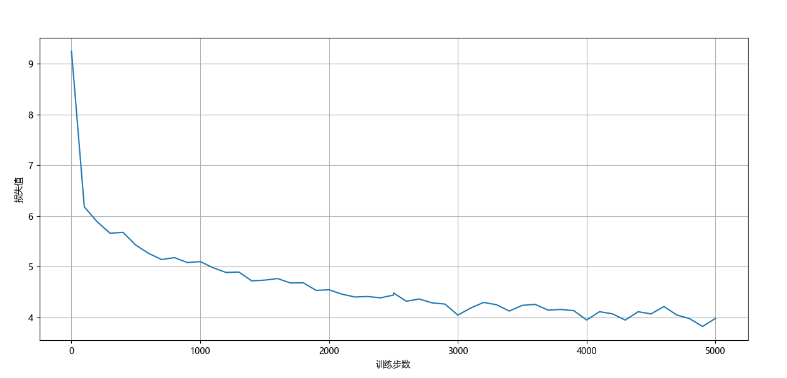

### Dream Weaver Redux

我决定训练一个模型，从第八十回续写《红楼梦》。

**一 、这个项目参考了[nanoGPT](https://github.com/karpathy/nanoGPT)。**

nanoGPT是一个由Andrej Karpathy开发的开源项目，它提供了一个精简且高效的框架，专门用于训练小型的生成式预训练Transformer模型。
<br>这个项目利用PyTorch库，使得即使是计算资源有限的个人开发者也能够轻松地进入自然语言处理的领域。

**二 、这是我的模型**

```text
AncientChineseGPT(
  (transformer): ModuleDict(
    (wte): Embedding(9569, 512)
    (wpe): Embedding(9569, 512)
    (drop): Dropout(p=0.1, inplace=False)
    (h): ModuleList(
      (0-11): 12 x Block(
        (ln_1): LayerNorm()
        (attn): MultiHeadAttention(
          (c_attn): Linear(in_features=512, out_features=1536, bias=False)
          (c_proj): Linear(in_features=512, out_features=512, bias=False)
          (attn_dropout): Dropout(p=0.1, inplace=False)
          (resid_dropout): Dropout(p=0.1, inplace=False)
        )
        (ln_2): LayerNorm()
        (mlp): MLP(
          (c_fc): Linear(in_features=512, out_features=2048, bias=False)
          (gelu): GELU(approximate='none')
          (c_proj): Linear(in_features=2048, out_features=512, bias=False)
          (dropout): Dropout(p=0.1, inplace=False)
        )
      )
    )
    (ln_f): LayerNorm()
  )
  (lm_head): Linear(in_features=512, out_features=9569, bias=False)
)
```

**三 、这是我训练的成果**



**四、分析自注意力机制**

```text
X: ['好好学习，天天向上。', '天下武功，唯快不破。']
X: torch.Size([2, 10])
embedding weight: torch.Size([15, 8])
embed X: torch.Size([2, 10, 8])
X * 3投影: torch.Size([2, 10, 24])
X在最后一维上分割成 Q，K，V： torch.Size([2, 10, 8]) torch.Size([2, 10, 8]) torch.Size([2, 10, 8])
Q，K，V 分2个头，新增`头数`维度，把`头数`放在`序列长度`前面： torch.Size([2, 2, 10, 4]) torch.Size([2, 2, 10, 4]) torch.Size([2, 2, 10, 4])
Q 点乘 K 计算它俩相似度： torch.Size([2, 2, 10, 10])
用于构造的掩码矩阵的三角矩阵： torch.Size([1, 1, 10, 10])
tensor([[[[1., 0., 0., 0., 0., 0., 0., 0., 0., 0.],
          [1., 1., 0., 0., 0., 0., 0., 0., 0., 0.],
          [1., 1., 1., 0., 0., 0., 0., 0., 0., 0.],
          [1., 1., 1., 1., 0., 0., 0., 0., 0., 0.],
          [1., 1., 1., 1., 1., 0., 0., 0., 0., 0.],
          [1., 1., 1., 1., 1., 1., 0., 0., 0., 0.],
          [1., 1., 1., 1., 1., 1., 1., 0., 0., 0.],
          [1., 1., 1., 1., 1., 1., 1., 1., 0., 0.],
          [1., 1., 1., 1., 1., 1., 1., 1., 1., 0.],
          [1., 1., 1., 1., 1., 1., 1., 1., 1., 1.]]]])
掩码后的相似度矩阵： torch.Size([2, 2, 10, 10])
softmax激活后的相似度： torch.Size([2, 2, 10, 10])
多头注意力权重（相似度） 点乘 V 得到预测值Y
（每个token得到一个预测值，且每个token的预测值只与这个token所在序列中前面的token相关，后面的token通过掩码矩阵和softmax使其注意力权重为0）：
 torch.Size([2, 2, 10, 4])
多头注意力合并： torch.Size([2, 10, 8])
预测值Y进行层归一化： torch.Size([2, 10, 8])
预测值Y从8维 线性投影 到15维： torch.Size([2, 10, 15])
预测值Y使用softmax回归到0~1之间的概率： torch.Size([2, 10, 15])
概率最大的那个下标就是预测值Y：
tensor([[13, 13, 13,  0, 13,  9,  9,  9,  6,  6],
        [ 9,  6,  6,  6,  6,  6,  6, 13,  6, 13]])
Y： ['破破破。破好好好向向', '好向向向向向向破向破']

Process finished with exit code 0
```