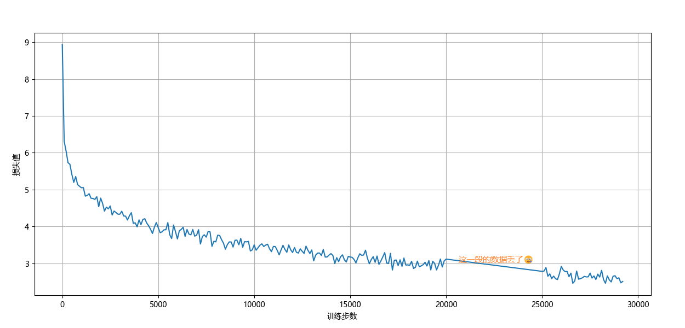

### Dream Weaver Redux

我决定训练一个模型，从第八十回续写《红楼梦》。

**一 、这个项目参考了[nanoGPT](https://github.com/karpathy/nanoGPT)。**

nanoGPT是一个由Andrej Karpathy开发的开源项目，它提供了一个精简且高效的框架，专门用于训练小型的生成式预训练Transformer模型。
<br>这个项目利用PyTorch库，使得即使是计算资源有限的个人开发者也能够轻松地进入自然语言处理的领域。

**二 、这是我的模型**

```text
NovelGPT(
  (transformer): ModuleDict(
    (wte): Embedding(6823, 512)
    (wpe): Embedding(6823, 512)
    (drop): Dropout(p=0.1, inplace=False)
    (h): ModuleList(
      (0-11): 12 x Block(
        (ln_1): LayerNorm()
        (attn): MultiHeadAttention(
          (c_attn): Linear(in_features=512, out_features=1536, bias=False)
          (c_proj): Linear(in_features=512, out_features=512, bias=False)
          (attn_dropout): Dropout(p=0.1, inplace=False)
          (resid_dropout): Dropout(p=0.1, inplace=False)
        )
        (ln_2): LayerNorm()
        (mlp): MLP(
          (c_fc): Linear(in_features=512, out_features=2048, bias=False)
          (gelu): GELU(approximate='none')
          (c_proj): Linear(in_features=2048, out_features=512, bias=False)
          (dropout): Dropout(p=0.1, inplace=False)
        )
      )
    )
    (ln_f): LayerNorm()
  )
  (lm_head): Linear(in_features=512, out_features=6823, bias=False)
)
```

**三 、这是我训练的成果**

