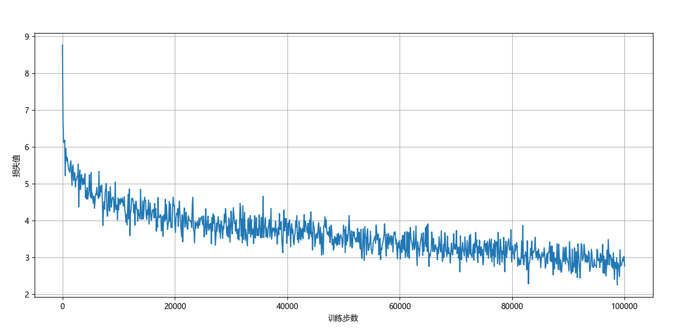

### Dream Weaver Redux

我决定训练一个模型，从第八十回续写《红楼梦》。

**这个项目参考了[nanoGPT](https://github.com/karpathy/nanoGPT)。**

 nanoGPT是一个由Andrej Karpathy开发的开源项目，它提供了一个精简且高效的框架，专门用于训练小型的生成式预训练Transformer（GPT）模型。
 这个项目利用PyTorch库，使得即使是计算资源有限的个人开发者也能够轻松地进入自然语言处理的领域。
 通过简化的代码结构和清晰的文档，nanoGPT降低了学习和实验深度学习算法的门槛，同时提供了丰富的示例和教程，帮助用户快速上手并探索模型的潜力。
 它的设计哲学是使先进的自然语言处理技术更加普及和易于理解，从而推动AI教育和创新。

**这是我训练的成果**

